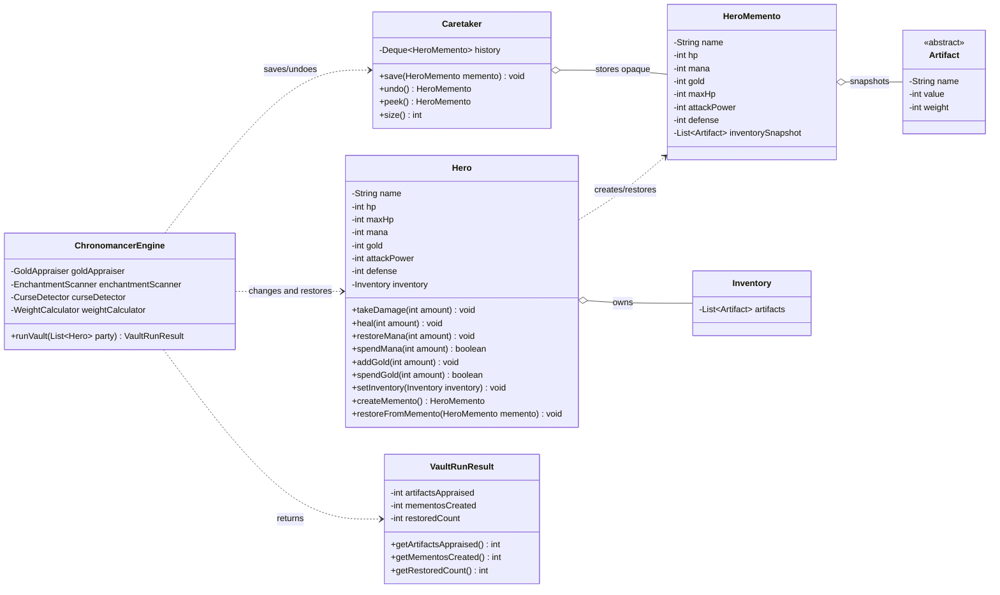

# Memento UML Diagram

```mermaid
classDiagram
    direction LR

    class Hero {
        -String name
        -int hp
        -int maxHp
        -int mana
        -int gold
        -int attackPower
        -int defense
        -Inventory inventory
        +takeDamage(int amount) void
        +heal(int amount) void
        +restoreMana(int amount) void
        +spendMana(int amount) boolean
        +addGold(int amount) void
        +spendGold(int amount) boolean
        +setInventory(Inventory inventory) void
        +createMemento() HeroMemento
        +restoreFromMemento(HeroMemento memento) void
    }

    class HeroMemento {
        -String name
        -int hp
        -int mana
        -int gold
        -int maxHp
        -int attackPower
        -int defense
        -List~Artifact~ inventorySnapshot
    }

    class Caretaker {
        -Deque~HeroMemento~ history
        +save(HeroMemento memento) void
        +undo() HeroMemento
        +peek() HeroMemento
        +size() int
    }

    class ChronomancerEngine {
        -GoldAppraiser goldAppraiser
        -EnchantmentScanner enchantmentScanner
        -CurseDetector curseDetector
        -WeightCalculator weightCalculator
        +runVault(List~Hero~ party) VaultRunResult
    }

    class VaultRunResult {
        -int artifactsAppraised
        -int mementosCreated
        -int restoredCount
        +getArtifactsAppraised() int
        +getMementosCreated() int
        +getRestoredCount() int
    }

    class Inventory {
        -List~Artifact~ artifacts
    }

    class Artifact {
        <<abstract>>
        -String name
        -int value
        -int weight
    }

    Hero ..> HeroMemento : creates/restores
    Hero o-- Inventory : owns
    HeroMemento o-- Artifact : snapshots

    Caretaker o-- HeroMemento : stores opaque
    ChronomancerEngine ..> Hero : changes and restores
    ChronomancerEngine ..> Caretaker : saves/undoes
    ChronomancerEngine ..> VaultRunResult : returns
```