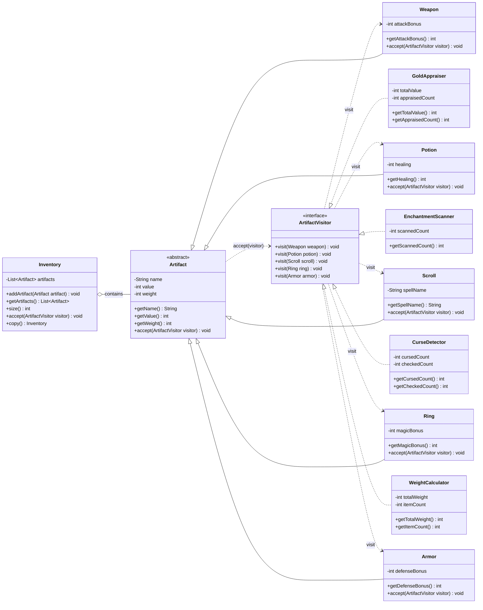

# Visitor UML Diagram

```mermaid
classDiagram
    direction LR

    class ArtifactVisitor {
        <<interface>>
        +visit(Weapon weapon) void
        +visit(Potion potion) void
        +visit(Scroll scroll) void
        +visit(Ring ring) void
        +visit(Armor armor) void
    }

    class Artifact {
        <<abstract>>
        -String name
        -int value
        -int weight
        +getName() String
        +getValue() int
        +getWeight() int
        +accept(ArtifactVisitor visitor) void
    }

    class Weapon {
        -int attackBonus
        +getAttackBonus() int
        +accept(ArtifactVisitor visitor) void
    }

    class Potion {
        -int healing
        +getHealing() int
        +accept(ArtifactVisitor visitor) void
    }

    class Scroll {
        -String spellName
        +getSpellName() String
        +accept(ArtifactVisitor visitor) void
    }

    class Ring {
        -int magicBonus
        +getMagicBonus() int
        +accept(ArtifactVisitor visitor) void
    }

    class Armor {
        -int defenseBonus
        +getDefenseBonus() int
        +accept(ArtifactVisitor visitor) void
    }

    class Inventory {
        -List~Artifact~ artifacts
        +addArtifact(Artifact artifact) void
        +getArtifacts() List~Artifact~
        +size() int
        +accept(ArtifactVisitor visitor) void
        +copy() Inventory
    }

    class GoldAppraiser {
        -int totalValue
        -int appraisedCount
        +getTotalValue() int
        +getAppraisedCount() int
    }

    class EnchantmentScanner {
        -int scannedCount
        +getScannedCount() int
    }

    class CurseDetector {
        -int cursedCount
        -int checkedCount
        +getCursedCount() int
        +getCheckedCount() int
    }

    class WeightCalculator {
        -int totalWeight
        -int itemCount
        +getTotalWeight() int
        +getItemCount() int
    }

    Artifact <|-- Weapon
    Artifact <|-- Potion
    Artifact <|-- Scroll
    Artifact <|-- Ring
    Artifact <|-- Armor

    Inventory o-- Artifact : contains
    Artifact ..> ArtifactVisitor : accept(visitor)

    ArtifactVisitor <|.. GoldAppraiser
    ArtifactVisitor <|.. EnchantmentScanner
    ArtifactVisitor <|.. CurseDetector
    ArtifactVisitor <|.. WeightCalculator

    ArtifactVisitor ..> Weapon : visit
    ArtifactVisitor ..> Potion : visit
    ArtifactVisitor ..> Scroll : visit
    ArtifactVisitor ..> Ring : visit
    ArtifactVisitor ..> Armor : visit
```